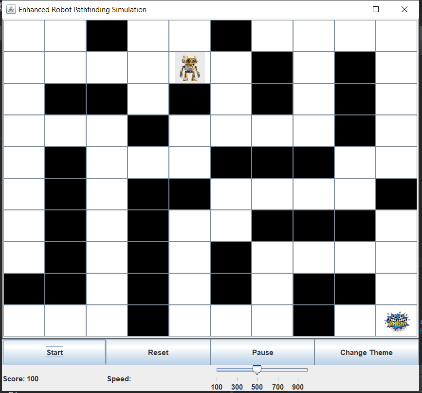
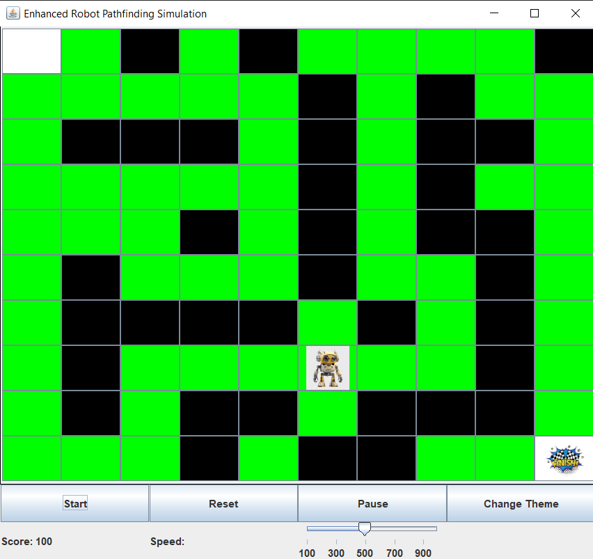

# Enhanced Robot Pathfinding Simulation

{:height="200px" width="200px"}
{:height="300px" width="300px"}

## Overview

**Enhanced Robot Pathfinding Simulation** is a Java Swing application that demonstrates a grid-based robot pathfinding algorithm. It allows users to create obstacles, visualize the robot's movement, and customize themes.

---

## Features

- **Interactive Grid:** Click on the grid to add or remove obstacles dynamically.
- **Pathfinding Algorithm:** Uses a priority queue-based shortest path algorithm.
- **Dynamic Controls:** Start, reset, pause/resume, and switch themes.
- **Adjustable Speed:** Use the slider to change the robot's movement speed accordingly.
- **Custom Themes:** Switch between `Default`, `Space`, and `Jungle` themes.
- **Score Tracking:** Tracks the robot's progress with a score system.

---

## How to Run

### Prerequisites

- **Java Development Kit (JDK)** 8 or higher.
- Swing library (default in JDK).

### Steps

1. Clone the repository:
   ```bash
   git clone https://github.com/KamalAle12/RobotPathfinding.git
   cd RobotPathfinding
   
This project is open source, and we welcome your contributions! Feel free to fork the repository, create new features, or improve existing ones. Contributions are highly appreciated.

To contribute:

1. Fork the repository.
2. Create a new branch for your feature or fix.
3. Commit your changes and open a pull request.
